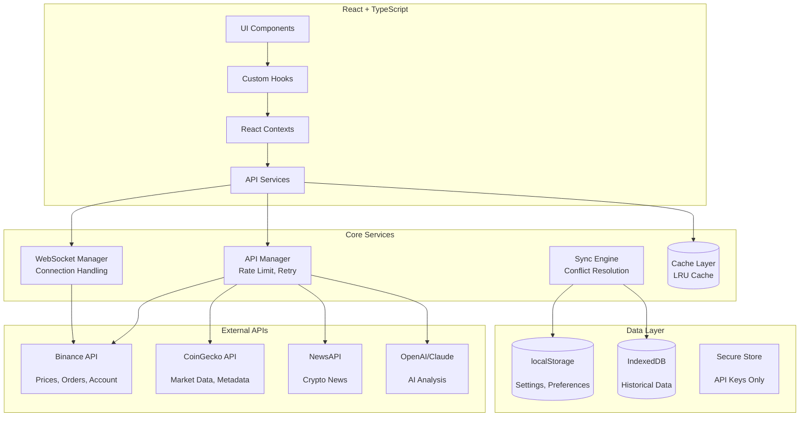
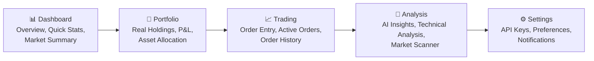
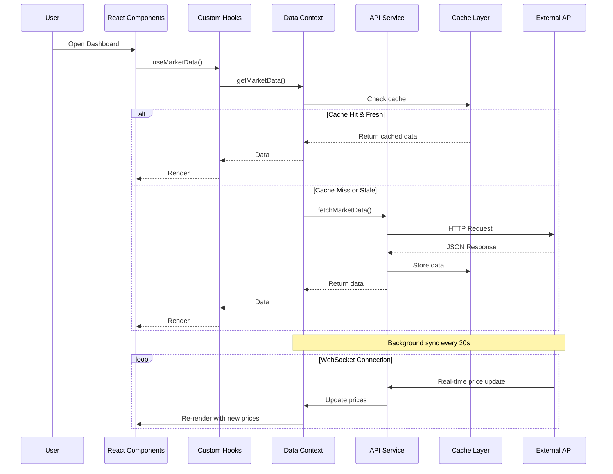
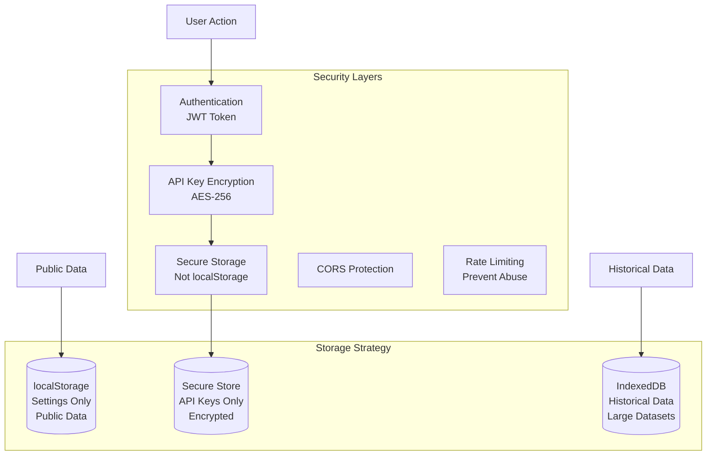
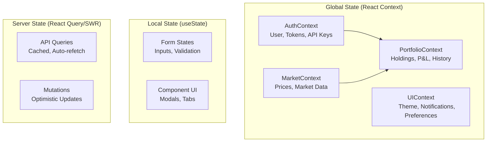

# แผนปรับปรุง Architecture - Crypto Dashboard แบบใช้งานได้จริง

## Executive Summary

แอพเดิมมีปัญหาหลักคือ:
- ใช้ Mock Data 100% - ไม่มี API integration จริง
- ฟีเจอร์เยอะเกินไปแต่ใช้ไม่ได้จริง (15+ sections)
- ไม่มี Authentication หรือ Security
- ไม่มี Data Persistence ที่ดี
- UX/UI ซับซ้อนเกินไป

แผนนี้จะสร้างระบบที่:
- เชื่อมต่อ API จริง (Binance, CoinGecko, NewsAPI, OpenAI)
- มี Authentication & Security ที่ปลอดภัย
- ลดฟีเจอร์เหลือ 5-7 ตัวที่ใช้งานได้จริง
- มี Data Flow ที่ชัดเจนและ reliable

---

## System Architecture



---

## Simplified Navigation Structure

จากเดิม 15+ sections เหลือ 5 Core Modules:



---

## Core Features - ใช้งานได้จริง

### 1. Dashboard Module
**มีอะไร:**
- Market Overview: ราคา BTC, ETH, Dominance, Fear & Greed Index (จาก CoinGecko API จริง)
- Quick Stats: Portfolio Value, 24h Change, Top Gainers/Losers
- Mini Charts: Sparkline 24h สำหรับ top coins
- Recent Activity: Recent trades, alerts triggered

**ไม่มี:**
- ❌ ข้อมูลลวงจาก mockData.ts
- ❌ AI "Accuracy" ที่ไม่มีที่มา
- ❌ Whale alerts ปลอม

### 2. Portfolio Module
**มีอะไร:**
- Real Holdings: ดึงจาก Binance API (spot, margin, futures) หรือ manual input
- P&L Tracking: Realized/Unrealized P&L คำนวณจาก avg buy price จริง
- Asset Allocation: Pie chart แสดงสัดส่วน assets
- Transaction History: ดึงจาก exchange หรือ import CSV
- Performance Chart: Portfolio value over time (บันทึก daily snapshot)

**ไม่มี:**
- ❌ Mock assets ที่ไม่มีตัวตนจริง
- ❌ VaR calculation ที่ใช้ข้อมูลลวง

### 3. Trading Module
**มีอะไร:**
- Order Entry: Place market/limit/stop-loss orders (ถ้าเชื่อม API keys)
- Active Orders: Track pending orders, cancel orders
- Order History: ดูประวัติ orders ที่ filled/cancelled
- Position Summary: ดู positions ปัจจุบัน (สำหรับ futures)

**ไม่มี:**
- ❌ "Deposit/Withdraw" dialogs ที่เป็นแค่ UI (ถ้าจะมีต้องเชื่อมจริง)

### 4. Analysis Module
**มีอะไร:**
- AI Market Analysis: ใช้ OpenAI API วิเคราะห์ trend จากราคา + ข่าว
- Technical Indicators: คำนวณ RSI, MACD, EMA จาก price data จริง
- Market Scanner: Filter coins ตามเงื่อนไขที่กำหนด (volume > X, change > Y%)
- News Feed: ดึงข่าว crypto จาก NewsAPI
- Correlation Matrix: วิเคราะห์ความสัมพันธ์ระหว่าง assets

**ไม่มี:**
- ❌ Static "AI Insights" ที่ไม่ update
- ❌ Static RSI heatmap
- ❌ Fake "reversal signals"

### 5. Settings Module
**มีอะไร:**
- API Key Management: ใส่ Binance API keys (stored securely, encrypted)
- Preferences: Currency (USD/THB), Theme, Notifications
- Alert Configuration: Price alerts, ตั้งค่า threshold
- Account: Profile, logout

---

## Data Flow Architecture



---

## Security Architecture



---

## API Integration Strategy

### 1. Binance API (Primary)
**ใช้สำหรับ:**
- Real-time prices (WebSocket)
- Account info (ถ้ามี API keys)
- Order management (ถ้ามี API keys)
- Kline/Candlestick data

**Rate Limits:**
- REST: 1200 request/minute
- WebSocket: 5 connections per IP

**Implementation:**
- WebSocket for real-time prices
- REST API for historical data
- Circuit breaker pattern for failures

### 2. CoinGecko API (Secondary)
**ใช้สำหรับ:**
- Market data (market cap, volume, dominance)
- Historical charts (long-term)
- Coin metadata (description, links)
- Global market data (Fear & Greed)

**Rate Limits:**
- Free tier: 10-30 calls/minute
- Pro tier: 500 calls/minute

### 3. NewsAPI / CryptoPanic
**ใช้สำหรับ:**
- Crypto news feed
- Sentiment analysis input

### 4. OpenAI/Claude API
**ใช้สำหรับ:**
- Market analysis generation
- News summary
- Trading insights (not financial advice)

**Rate Limits:**
- Depends on tier
- Implement request queuing

---

## State Management Strategy



---

## Technical Implementation Plan

### Phase 1: Foundation (Week 1-2)
1. Setup project structure
2. Create unified API service layer
3. Implement error handling & retry logic
4. Setup WebSocket connection manager
5. Create data caching system

### Phase 2: Core Features (Week 3-4)
1. Dashboard with real market data
2. Portfolio tracking (manual input first)
3. Basic price alerts
4. Settings management

### Phase 3: Advanced Features (Week 5-6)
1. Binance API integration (optional)
2. Technical indicators calculation
3. AI analysis integration
4. Market scanner

### Phase 4: Polish (Week 7-8)
1. UI/UX refinement
2. Mobile optimization
3. Performance tuning
4. Testing & bug fixes

---

## File Structure (New)

```
src/
├── api/                    # API service layer
│   ├── binance.ts         # Binance API
│   ├── coingecko.ts       # CoinGecko API
│   ├── openai.ts          # AI service
│   └── client.ts          # HTTP client with retry
├── components/            # Reusable components
│   ├── ui/               # shadcn components
│   └── common/           # Custom components
├── contexts/             # React contexts
│   ├── AuthContext.tsx
│   ├── MarketContext.tsx
│   ├── PortfolioContext.tsx
│   └── UIContext.tsx
├── hooks/                # Custom hooks
│   ├── useMarketData.ts
│   ├── usePortfolio.ts
│   ├── useAuth.ts
│   └── useAlerts.ts
├── lib/                  # Utilities
│   ├── utils.ts
│   ├── encryption.ts     # API key encryption
│   ├── indicators.ts     # Technical analysis
│   └── cache.ts          # Caching logic
├── pages/                # Page components
│   ├── Dashboard.tsx
│   ├── Portfolio.tsx
│   ├── Trading.tsx
│   ├── Analysis.tsx
│   └── Settings.tsx
├── services/             # Business logic
│   ├── alertService.ts
│   ├── syncService.ts
│   └── aiService.ts
├── stores/               # State stores
│   ├── localStorage.ts
│   └── secureStore.ts
├── types/                # TypeScript types
│   └── index.ts
└── config/               # App configuration
    ├── api.config.ts
    └── features.ts       # Feature flags
```

---

## Success Metrics

- [ ] API calls succeed > 99% of the time
- [ ] Data loads in < 2 seconds
- [ ] WebSocket maintains stable connection
- [ ] No mock data in production
- [ ] All buttons perform real actions
- [ ] Mobile responsive
- [ ] PWA installable

---

## Risk Mitigation

| Risk | Mitigation |
|------|------------|
| API Rate Limits | Implement aggressive caching, request queuing |
| WebSocket Disconnection | Auto-reconnect with exponential backoff |
| Data Loss | Sync to IndexedDB, daily exports |
| API Key Exposure | Client-side encryption, never store raw keys |
| Slow Performance | Code splitting, lazy loading, virtualization |
